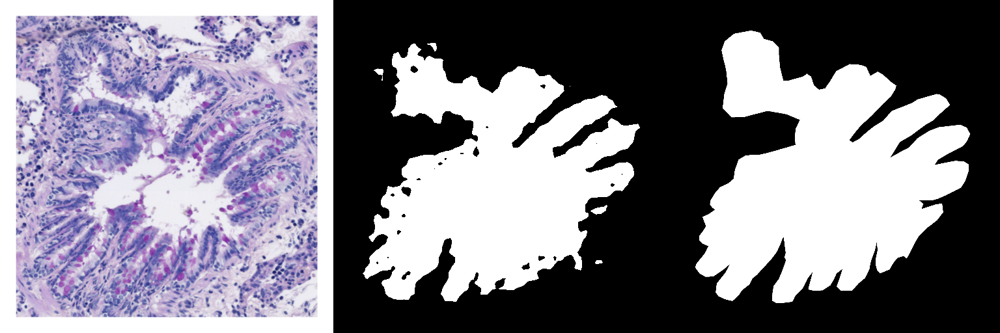

## This is a project which uses a Pyramid Scene Pooling Network to segment medical images of lung slices of mice. It is used in a pathology project.
## As it is my personal side project, I prohibit any and all commercial uses. Otherwise feel free to use it as backbone for your task.

